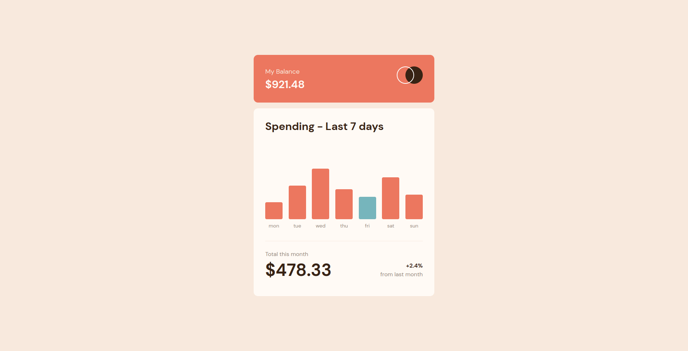

# Frontend Mentor - Expenses chart component solution

This is a solution to the [Expenses chart component challenge on Frontend Mentor](https://www.frontendmentor.io/challenges/expenses-chart-component-e7yJBUdjwt). Frontend Mentor challenges help you improve your coding skills by building realistic projects.

## Table of contents

- [Frontend Mentor - Expenses chart component solution](#frontend-mentor---expenses-chart-component-solution)
  - [Table of contents](#table-of-contents)
  - [Overview](#overview)
    - [The challenge](#the-challenge)
    - [Screenshot](#screenshot)
    - [Links](#links)
  - [My process](#my-process)
    - [Built with](#built-with)
    - [What I learned](#what-i-learned)
    - [Continued development](#continued-development)
  - [Author](#author)
  - [Acknowledgments](#acknowledgments)

## Overview

### The challenge

Users should be able to:

- View the bar chart and hover over the individual bars to see the correct amounts for each day
- See the current day’s bar highlighted in a different colour to the other bars
- View the optimal layout for the content depending on their device’s screen size
- See hover states for all interactive elements on the page
- **Bonus**: Use the JSON data file provided to dynamically size the bars on the chart

### Screenshot

- Mobile design 
- Desktop design 

### Links

- Solution URL: [Github](https://github.com/TheSunLand7/expenses-chart-component)
- Live Site URL: [Netlify](https://interactive-form-mentor.netlify.app/)

## My process

### Built with

- Semantic HTML5 markup
- CSS custom properties
- Flexbox
- Mobile-first workflow
- [Tailwind CSS](https://tailwindcss.com/) - CSS library
- [Vite](https://vite.dev)
- [Typescript](https://typescriptlang.org/) - For Logic

### What I learned

I've learned how to manipulate DOM to make chartflow dynamic

### Continued development

I am improving my Typescript skills.

## Author

- Website - [xiayudev](https://my-portfolio-v2-1.pages.dev/)
- Frontend Mentor - [@TheSunLand7](https://www.frontendmentor.io/profile/TheSunLand7)
- Twitter - [@J7Jeo](https://www.twitter.com/J7Jeo)

## Acknowledgments

A tip that helped me with weekdays was implementing Intl.DateTimeFormat object.

```ts
let currentDay: string = new Intl.DateTimeFormat("en-US", { weekday: "long" })
		.format()
		.toLowerCase(); //We get 'friday' for example.
```
